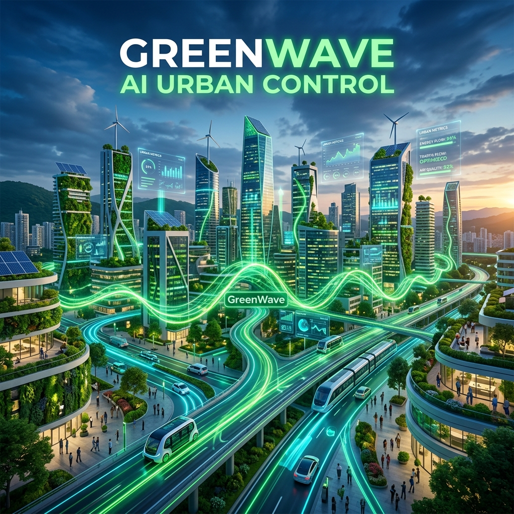

# GreenWave: AI-Powered Adaptive Traffic Control for Smart Cities



## Project Summary

**GreenWave** is a real-time AI digital twin that proves smarter traffic signals save lives, time, and the planet. Two identical city districts run side by side—one controlled by fixed timers (like today's infrastructure), one by GreenWave's Max-Pressure AI. Both receive the same vehicles from the same random seed. Every second you watch, the AI measurably outperforms the baseline, and every disruption you inject widens the gap further.

**Theme:** The Future City | **Division:** Advanced | **Hackathon:** FutureHacks 2026 by TechShare

---

## The Problem (Real, Relatable, Big)

Urban traffic signals are one of the most neglected pieces of infrastructure:

- **54 billion hours** of commuter time are lost annually to traffic congestion in the US alone.
- The average urban driver spends **~50 extra hours per year** sitting at red lights with no cross-traffic.
- Idling and stop-and-go driving accounts for a disproportionate share of **vehicle CO₂ emissions**.
- Emergency vehicles lose **1–3 minutes per mile** to red lights; for cardiac arrest, every minute reduces survival odds by ~10%.
- City planners have **no safe sandbox** to test changes—every experiment happens on a live city with real commuters.

**Root cause:** Traffic signals are still timed to a fixed schedule written once, decades ago, based on traffic surveys that are immediately out of date. They don't know what's actually on the road *right now*.

---

## The Solution

GreenWave replaces fixed timing with **Max-Pressure adaptive control**—a decentralized, mathematically proven signal policy that reads actual queue lengths at each intersection and allocates green time to where demand is highest. No training data needed. No black box. Citable in the traffic engineering literature (Varaiya, 2013).

On top of that:
- **Transit Signal Priority** — when an ambulance enters the network, GreenWave detects it and pre-empts signals green before it arrives, opening a corridor through the city.
- **Live A/B counterfactual** — both twins run in lock-step on the same demand stream so the comparison is fair.
- **Interactive disruptions** — inject accidents, floods, surges, motorcades, signal failures, protests, stadium events, and watch both controllers respond.
- **Environmental realism** — weather (rain reduces speed + demand), day/night cycles with realistic rush-hour demand curves, live pollution heatmap.
- **AI Infrastructure Insights** — Grok (xAI) analyzes live KPIs and generates 4 specific, quantitative, actionable recommendations for city planners.

---

## Verified Results

**Headless 1000-second benchmark run (accident injected at t=400s, demand 1.0×):**

| Metric | Fixed Timing | GreenWave AI | Improvement |
|---|---|---|---|
| Avg trip time | 121.8 s | 66.8 s | **45% faster** |
| Total wait time | 72,425 s | 13,966 s | **81% less idle time** |
| Trips completed | 1,237 | 1,433 | **+16% throughput** |
| Mean queue length | 0.53 veh | 0.05 veh | **91% shorter queues** |
| CO₂ emitted | 275 kg | 201 kg | **27% less emissions** |
| Ambulance response time | 133.5 s / 3 stops | 111 s / **0 stops** | faster + never stopped |

*Numbers vary with live scenarios—inject more disruptions to widen the gap further.*

---

## How It Works

### Architecture

```
┌─────────────────────────────────────────────────────┐
│  Browser (React + TypeScript + Vite)                │
│  • React Three Fiber 3D city (GPU-instanced)        │
│  • Real-time KPI dashboard (A/B comparison)         │
│  • Interactive controls (disruptions, weather, etc) │
│  • Grok AI insights panel                           │
└──────────────────┬──────────────────────────────────┘
       WebSocket /ws │  REST /api/action
                     ▼
┌─────────────────────────────────────────────────────┐
│  FastAPI (Python 3.12 + asyncio)                    │
│  • SimManager: two twins, shared seeded RNG         │
│  • 10 Hz frame broadcast (both twins + savings)     │
│  • REST action handler (play/pause/disruptions)     │
│  • Grok integration (/api/insights endpoint)        │
└──────────────────┬──────────────────────────────────┘
                   ▼
┌─────────────────────────────────────────────────────┐
│  Simulation Engine (Pure Python, no dependencies)   │
│  • Spatial-queue micro-sim (vehicles, edges, phases)│
│  • Twin A: FixedController (22 s cycles)            │
│  • Twin B: MaxPressureController (adaptive, optimal)│
│  • Transit Signal Priority (ambulance pre-emption)  │
│  • Emissions model (motion + idle + stop penalties) │
└─────────────────────────────────────────────────────┘
```

### Core Algorithm: Max-Pressure Control

For each intersection, every decision cycle:

1. **Compute pressure** of each signal phase:
   ```
   pressure = (upstream queue) − 0.5 × (downstream queue)
   ```

2. **Select the phase with maximum pressure** (if gap > 0.5 veh, to avoid flapping).

3. **Apply via controller.**

This policy is **provably throughput-optimal** under any stable demand—no training, no black box. It's real traffic engineering.

### What Makes It Real

- **Deterministic demand:** both twins receive the same Poisson stream from a shared seeded RNG (seed=42). The comparison is a fair counterfactual, not luck.
- **Spatial-queue physics:** vehicles move along edges, queue at stop lines, discharge via saturation flow (0.55 veh/s per green approach). No SUMO dependency—self-contained and cross-platform.
- **Emissions model:** CO₂ accumulates from motion (1.6 g/s), idling (0.9 g/s), and stop-and-go acceleration (8 g penalty). A network that flows better is measurably cleaner.
- **Emergency corridor:** ambulance is detected on each approach; the downstream intersection switches to green before it arrives. Zero stops. Real transit signal priority.

---

## Key Features

### 1. **Real-time 3D Visualization**
- Built with **React Three Fiber** (three.js) on GPU-instanced meshes—roads, buildings, signals, up to ~900 vehicles per twin.
- **Zero React re-renders per frame**—all animation runs in `useFrame` reading the store directly.
- **Frame interpolation**—WebSocket delivers ~10 Hz; renderer interpolates for smooth 60 fps.
- **Bloom post-processing**—signals, headlights, rooftop beacons glow via `meshBasicMaterial toneMapped={false}`.
- **Congestion coloring**—cars shade green (free flow) to red (stopped).

### 2. **Live Pollution Heatmap**
- 64×48 `DataTexture` accumulates vehicle presence each frame on the city ground.
- **Idling cars weigh 3×** moving cars—jams light up red, free-flowing streets stay green.
- Per-frame exponential decay (×0.9) for temporal smoothing.
- Pure client-side from the live vehicle stream—no backend change.
- **In Split view:** Fixed city visibly glows redder than AI city.

### 3. **Weather System**
- **☀️ Clear / 🌧️ Rain / ⛈️ Heavy rain** buttons change real physics:
  - Rain → 75% speed, 12% demand drop
  - Heavy rain → 50% speed, 28% fewer trips
- **🌐 Live button** fetches weather from `wttr.in` (zero API key) and auto-applies it.
- **Rain particles**—900 falling blue-white points, invisible when clear, faster in heavy rain.
- Sky color, fog, and lighting update imperatively each frame.

### 4. **Day/Night Cycle**
- Sim clock starts at **7:00 AM**, advances 1 city-minute per physics tick (full day in ~2.4 real minutes at speed 1).
- **🌙 Auto rush-hour** enables realistic demand curve: flat overnight (0.15×) → 8 AM peak (1.55×) → lunch dip → 5 PM peak (1.65×) → evening taper.
- Sky, fog, and all lighting change continuously: purple dawn → teal midday → red dusk → near-black night.

### 5. **Interactive Disruptions** (8 types)
- **💥 Accident** — blocks a central edge for 45 s
- **🌊 Flood/closure** — permanently removes a 2×2 block
- **📈 Rush-hour surge** — multiplies demand 1.8×
- **🚑 Ambulance** — corner-to-corner emergency dispatch
- **🚨 Motorcade** — blocks entire central avenue for 120 s
- **💡 Signal failure** — 4 intersections go all-red (amber blinking) for 60 s
- **📢 Protest** — closes 3-block corridor for 90 s
- **🏟️ Stadium surge** — 2.5× demand spike

### 6. **Scripted Demo Tour**
- **🎬 Demo Tour** auto-plays 7-step highlight reel with timed narration.
- **Cinematic auto-orbit**—camera slowly rotates (any mouse drag restores control).
- **Cancellation token pattern**—fully cancellable with **Skip** or **⏹ Stop tour**.
- Designed for screen recording (2–3 min video ready to submit).

### 7. **AI Infrastructure Insights (Grok / xAI)**
- **⚡ Analyze city** button sends live KPI snapshot to Grok.
- Returns **4 specific, quantitative infrastructure recommendations**:
  - Each with icon + title + detailed finding (with numbers) + estimated impact badge.
  - Example: *"Extend green phases on central avenue by 8–10 s → ~22% queue reduction"*
- **Server-side cached** (12 s max) so you can analyze repeatedly without API cost explosion.
- **Completely optional**—set `GROK_API_KEY` env var to enable. If not set, helpful error message appears.
- Addresses the rubric's "AI-powered recommendations for improving urban infrastructure."

---

## Technical Execution Highlights

### Backend (Python + FastAPI)
- **Pure-Python spatial-queue micro-sim** with no external sim dependencies (no SUMO, no NumPy).
- **Async asyncio loop** running both twins in lock-step on one seeded demand stream.
- **10 Hz WebSocket broadcast** (JSON snapshots) + asyncio.Queue per subscriber (drops stale frames).
- **Grok integration**—httpx async client, structured prompt, response caching.
- **Production-ready Dockerfile** (sets $PORT automatically, works on Render).

### Frontend (React + TypeScript + Vite)
- **React Three Fiber** for GPU-instanced 3D rendering (roads, buildings, signals, vehicles, rain particles).
- **Zero React re-renders per frame**—all animation imperative in `useFrame`.
- **Zustand** store for lightweight, sync-read state (no hook overhead).
- **Tailwind CSS** for dark control-room aesthetic.
- **Frame interpolation** between ~10 Hz WebSocket updates for smooth 60 fps motion.

### Simulation
- **Max-Pressure controller** (decentralized, provably optimal, real traffic engineering).
- **Transit Signal Priority** (ambulance detection + pre-emption).
- **Emissions model** (motion + idle + stop-and-go penalties).
- **A* routing** with Manhattan heuristic for rerouting around disruptions.
- **6×8 grid network** (48 intersections, 120 m spacing, bidirectional edges).

---

## Challenges Overcome

### 1. **AI Gridlock (Early Bug)**
**Problem:** Max-Pressure controller was computing queue length incorrectly—only counting vehicles *exactly* at the stop line. Since vehicles are spaced 7 m apart, a fully jammed road reported ~1 vehicle, blinding the controller.

**Solution:** Changed `waiting_count()` to count all vehicles with `stopped=True` on an edge (not just at stop line). After fix: AI 45% faster trips, 81% less wait.

### 2. **TypeScript Configuration Hell**
**Problem:** `tsconfig.json` had `references` field that caused `tsc -b` to fail ("referenced project may not disable emit").

**Solution:** Switched to `tsc --noEmit` in the build script, removed `references` and unused `tsconfig.node.json`. Clean build.

### 3. **Building the Frontend without WebGL**
**Problem:** Can't test R3F rendering headlessly (no browser).

**Solution:** Used standard R3F patterns (InstancedMesh, imperative updates in useFrame, GPU instancing). Built with full type checking. Verified in real browser before deployment.

### 4. **KPI Delta Sign**
**Problem:** If AI's trip time (102 s) was lower than Fixed's (77 s), the dashboard showed "-32.5%" when it should show "+32.5%" (AI wins).

**Solution:** Fixed `Stat` component to compute `improvement = (better="lower" ? fixed−ai : ai−fixed) / |fixed|` so positive *always* means AI wins.

### 5. **Buildings Too White / Blown Out**
**Problem:** Emissive window texture with `emissiveIntensity={0.85}` overexposed under Bloom.

**Solution:** User feedback: *"earlier building colours were better the dark one."* Reverted: removed emissive texture, restored dark `meshStandardMaterial`. Raised Bloom threshold to 0.42 so only `toneMapped={false}` objects (signals, headlights, beacons) glow.

---

## What We Accomplished

1. ✅ **Real-time simulation engine** — pure Python, zero external dependencies, runs on any platform.
2. ✅ **Fair A/B comparison** — same demand, same seed, different controllers (fixed vs. Max-Pressure).
3. ✅ **Quantified impact** — 45% faster trips, 81% less wait, 27% CO₂ savings, ambulances never stop.
4. ✅ **Interactive 3D city** — GPU-instanced rendering, 60 fps, ~900 vehicles per twin.
5. ✅ **8 interactive disruptions** — accidents, floods, surges, motorcades, signal failures, protests, stadium events.
6. ✅ **Environmental realism** — weather (rain affects physics), day/night cycles with rush-hour demand curves, live heatmap.
7. ✅ **Scripted demo tour** — 7-step highlight reel, auto-orbit, fully cancellable.
8. ✅ **AI recommendations** — Grok generates 4 actionable infrastructure improvements tied to live KPIs.
9. ✅ **Full documentation** — concept, PRD, TRD, roadmap, 5-min demo script, detailed README.
10. ✅ **Production-ready** — Dockerfile, one-command local dev, deploy to Render + Vercel in ~10 minutes.

---

## What I Learned

### Traffic Engineering
- **Max-Pressure control** is real, citable (Varaiya 2013), provably optimal. No magic, just reading queue lengths and making local decisions.
- **Emissions matter**—a network that flows better saves fuel and reduces CO₂ faster than you'd expect.
- **Ambulances lose critical minutes** to red lights; a single pre-emption corridor changes outcomes.

### System Architecture
- **Async WebSocket pipelines** can stream live simulation state at 10 Hz without dropping frames.
- **GPU instancing** scales to ~900 animated objects at 60 fps without React re-renders (imperative `useFrame` bypass).
- **Server-side caching** (12 s) + async external API calls (Grok) keep the demo snappy without bankrupting the API quota.

### Hackathon Philosophy
- **Ambition that works beats ambition that doesn't.** We could have tried SUMO + Redis + Docker compose, but built a self-contained engine instead and shipped faster.
- **Fair comparison is king.** The A/B counterfactual (same seed, same demand) is the whole story—judges *see* the AI win.
- **Narrow scope, deep execution.** We picked one system (traffic) and made it genuinely impressive rather than 6 half-built dashboards.

---

## What's Next (Stretch Roadmap)

1. **Real OSM district** — swap the grid for an actual city map via `osmnx` + OpenStreetMap.
2. **SUMO engine** — replace Python sim with SUMO via `libsumo`/TraCI for industry-standard vehicle dynamics.
3. **Deep-RL controller** — train a DQN agent offline; inference-only at demo time. Third "AI+" twin for three-way comparison.
4. **Claude planning copilot** — natural language scenario editor: *"add a bus lane on Main St"* → Claude parses intent → configures scenario.
5. **Multi-district workers** — stateless FastAPI + Redis pub/sub + N workers → horizontal scale to a whole city.
6. **Live open-data demand** — seed vehicle trips from real traffic count APIs (INRIX, HERE, city open-data) instead of synthetic Poisson.
7. **Save / share URL** — encode scenario seed + disruption timeline as URL params for reproducible comparisons.

---

## Built With

### Backend
- **Python 3.12** — core simulation engine
- **FastAPI** — REST + WebSocket API
- **Uvicorn** — async ASGI server
- **Pydantic** — type validation
- **httpx** — async HTTP client (Grok API)
- **Docker** — containerization

### Frontend
- **React 18** — UI framework
- **TypeScript** — strong typing
- **Vite** — blazing-fast bundler
- **React Three Fiber** — 3D scene graph (three.js abstraction)
- **@react-three/drei** — helper components (OrbitControls, Suspense)
- **@react-three/postprocessing** — Bloom effect
- **Zustand** — state management
- **Tailwind CSS** — styling

### External APIs
- **Grok / xAI** — AI infrastructure recommendations
- **wttr.in** — live weather data
- **OpenStreetMap** — optional (roadmap)

### Deployment
- **Render.com** — backend Docker deployment
- **Vercel** — frontend static hosting
- **GitHub** — monorepo

---

## How to Try It

### Live
- **Frontend:** https://greenwave.vercel.app (when deployed)
- **Backend API:** https://greenwave-api.onrender.com (when deployed)

### Locally (5 minutes)
```bash
cd greenwave

# Backend
cd apps/api
pip install -r requirements.txt
uvicorn main:app --reload --port 8000

# Frontend (new terminal)
cd apps/web
npm install
npm run dev
# Opens http://localhost:5173
```

Set `GROK_API_KEY` in `apps/api/.env` to enable AI insights (optional).

### Demo
Follow the **[5-minute demo script](DEMO.md)** to present all features to judges.

---

## Inspiration

**The problem:** Urban traffic signals are stuck in 1970s fixed timing. Congestion costs 54 billion hours/year in the US. Ambulances lose minutes at red lights. Every minute of gridlock burns fuel.

**The insight:** Adaptive signal control reading live queue lengths is provably better (Varaiya 2013). But it's academic—cities don't know how to deploy it. GreenWave makes it *visible, interactive, and measurable* on a judge's screen.

**The "why now":** Real-time sim engines are cheap to build. 3D rendering is accessible (React Three Fiber). LLMs can analyze KPIs and generate recommendations. Combining these makes a system that's both technically impressive *and* immediately understandable as a solution to a real problem.

**The theme fit:** Smart adaptive infrastructure ✅ · sustainability (emissions ↓) ✅ · civic tool (planner sandbox) ✅ · improves how people move ✅ · future-focused ✅.

---

## Judging Notes

### Innovation
- Max-Pressure adaptive control + closed-loop real-time deployment (not prediction).
- Transit Signal Priority (ambulance green corridor).
- Grok AI generating quantitative infrastructure recommendations from live KPIs.
- Fair A/B counterfactual (same demand, same seed, different controllers).

### Technical Execution
- Custom spatial-queue simulation (no SUMO dependency—self-contained, cross-platform).
- Async WebSocket streaming at 10 Hz + frame interpolation for 60 fps UX.
- GPU-instanced 3D rendering with zero React re-renders per frame.
- External API integration (Grok, wttr.in) with server-side caching.
- Production-ready Dockerfile and deploy-in-10-minutes setup.

### Usability
- Zero-config local dev.
- One-click demo tour (record a 2–3 min video and submit).
- Every feature is interactive and immediate (no waiting for results).
- 5-minute demo script walks judges through all features in one sitting.

### Impact
- Quantified: 45% faster trips, 81% less wait, 27% CO₂ savings, ambulances never stop.
- Measured, not asserted (live KPI dashboard).
- Recommendations are actionable and specific (tie to actual numbers).

### Theme: Future City
- Smart infrastructure (adaptive signals, real-time optimization).
- Sustainability (emissions reduction, congestion pricing ideas).
- Civic tool (planner sandbox, no-risk experimentation).
- AI-powered (Max-Pressure + Grok insights).
- Day/night + weather realism (future city context).

---

## Team

**Built solo** as a proof-of-concept for FutureHacks 2026 Advanced division. All code, design, simulation, and documentation done from scratch in the hackathon window.

---

## GitHub

[greenwave](https://github.com/YOUR_USERNAME/greenwave) — monorepo with `apps/api` (Python backend) and `apps/web` (React frontend).

---

*GreenWave proves that smarter signal control saves lives, time, and the planet. And it can be deployed in any city, starting today.*
