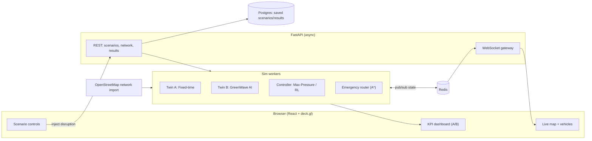
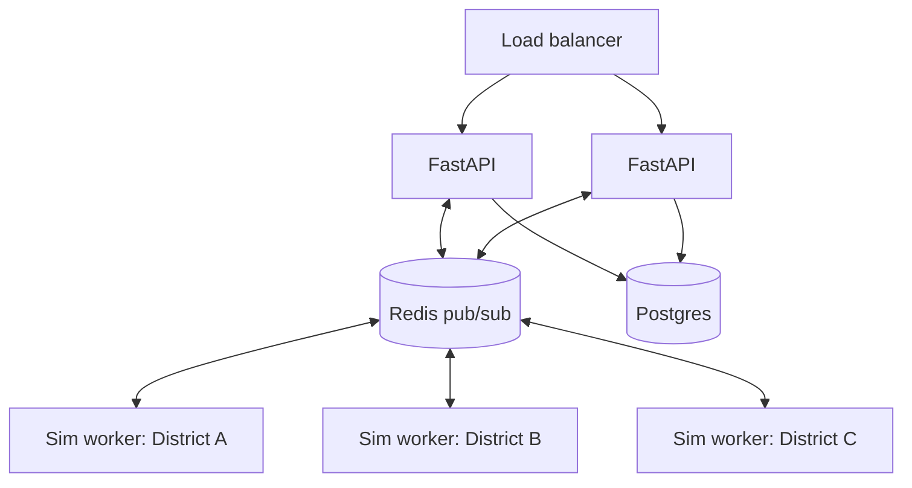

# 03 — Technical Requirements Document (TRD)

**Product:** GreenWave · **Division:** Advanced · **Status:** Draft v1
Companion to [02-PRD.md](02-PRD.md).

---

## 1. System overview
GreenWave is a **real-time simulation pipeline**: a backend runs a traffic micro-simulation of a
real road network, an AI controller sets signal phases each tick, and the evolving state is
streamed to a browser that renders vehicles and live KPIs. Two simulations (Fixed vs AI) run in
parallel so the UI can show a live counterfactual.



## 2. Tech stack (and why)
| Layer | Choice | Why |
|---|---|---|
| Frontend framework | **React + TypeScript + Vite** | Fast, familiar, great ecosystem |
| Map / geo render | **MapLibre GL** (or Mapbox GL) + **deck.gl** | GPU-accelerated rendering of thousands of moving vehicles |
| UI kit | **Tailwind CSS + shadcn/ui** | Polished "control-room" look fast |
| Charts | **Recharts** (or visx) | Live KPI sparklines |
| Client state | **Zustand** | Lightweight, simple real-time state |
| Realtime transport | **WebSocket** (binary, MessagePack) | Low-latency state streaming |
| Backend | **Python 3.11 + FastAPI + Uvicorn** | Async, websockets, ML ecosystem, matches Advanced brief |
| Sim engine (primary) | **SUMO** via **TraCI** (`libsumo` for speed) | Industry-standard open-source traffic simulator; real emission models |
| Sim engine (fallback) | **Custom queue/cell sim** (NumPy) | If SUMO setup risks the timeline — keeps the project shippable |
| AI controller | **Max-Pressure** control (NumPy) | Real, citable, no training, explainable |
| AI controller (stretch) | **Deep-RL (DQN)** via SUMO-RL + RLlib/Stable-Baselines3, trained offline | Bonus ambition; inference only at demo |
| Pub/sub + cache | **Redis** (Upstash in prod) | Decouples sim from clients; enables horizontal scale |
| Database | **Postgres** (Neon/Supabase); SQLite locally | Saved scenarios + results |
| LLM copilot (stretch) | **Claude API** — `claude-haiku-4-5-20251001` for fast cheap intent parsing, `claude-opus-4-8` for richer planning | NL → scenario config; on-theme modern AI |
| Containerization | **Docker** | SUMO needs a Linux runtime; reproducible deploy |
| Deploy (web) | **Vercel** | One-click, free, fast |
| Deploy (sim/API) | **Fly.io** or **Render** (Docker) | Runs the Linux SUMO container |

> **Decision rule:** Start Day 1 by getting *either* engine producing vehicle positions over a
> WebSocket. If SUMO isn't streaming by end of Day 2, switch to the custom sim and don't look back.

## 3. Components

### 3.1 Network import
- Use `osmnx` / SUMO's `osmWebWizard.py` / `netconvert` to convert an OSM extract of one district
  into a SUMO network (`.net.xml`). Cache the result as a static asset — don't import at runtime.
- Export a lightweight GeoJSON of edges + intersection coordinates for the frontend basemap.

### 3.2 Simulation engine
- **Primary (SUMO):** drive the sim with `libsumo`/TraCI: `step()` the sim, read vehicle positions
  (`vehicle.getPosition`), queue lengths, and emissions (`vehicle.getCO2Emission`), and set signal
  phases (`trafficlight.setRedYellowGreenState`). Run faster-than-realtime, downsample to the client.
- **Demand:** generate trips with `randomTrips.py` (seeded for determinism) + a demand multiplier
  for the "rush hour" slider.
- **Two twins:** run Twin A (fixed) and Twin B (AI) from the **same seed/demand** so the A/B is fair.
  MVP can run them sequentially/snapshotted if parallel is too heavy; ideal is two worker processes.

### 3.3 AI controller (Max-Pressure)
For each intersection, each decision step:
1. Compute **pressure** of each phase = (upstream queue) − (downstream queue) on the movements it serves.
2. Select the phase with **maximum pressure**; hold ≥ min-green to avoid flapping.
3. Apply via TraCI. Decentralized, O(phases) per intersection → cheap and scalable.
> Cite it in the pitch: Max-Pressure is a published, provably throughput-optimal control policy —
> this is *real* traffic engineering, not a black box.

### 3.4 Emergency router & green-corridor
- On "send ambulance": spawn a priority vehicle, compute its route with **A\*** over the network.
- As it approaches each intersection on the route, **pre-empt** that signal to green for its
  movement (Transit Signal Priority / Opticom-style), then release. Track its stop count & travel time.

### 3.5 Realtime gateway
- FastAPI WebSocket endpoint streams **frames** at ~10 Hz: `{tick, vehicles[], signals[], kpis}`.
- **Efficiency:** delta-encode positions, quantize coords to int, pack with **MessagePack**, cap
  payload to vehicles in the client viewport. Target frame < 50 KB at 1–2k vehicles.

### 3.6 Frontend
- deck.gl `ScatterplotLayer`/`TripsLayer` for vehicles, `PathLayer` for roads, colored nodes for
  signals. Interpolate positions between frames for smoothness. Zustand holds latest frame + KPIs.
- Control panel (shadcn) for play/pause/speed, mode toggle, disruption buttons, demand slider.

## 4. Data models (sketch)
```ts
type Scenario = {
  id: string; networkId: string; seed: number;
  demandMultiplier: number;
  disruptions: Disruption[];
  createdAt: string;
};
type Disruption =
  | { kind: "accident"; edgeId: string; lane?: number; durationS: number; atTick: number }
  | { kind: "closure"; edgeIds: string[] }            // flood / roadworks
  | { kind: "demandSurge"; multiplier: number; atTick: number }
  | { kind: "emergency"; from: string; to: string; atTick: number };

type Frame = {                                         // streamed over WS (as MessagePack)
  tick: number; mode: "fixed" | "ai";
  vehicles: { id: number; x: number; y: number; spd: number; emg?: boolean }[];
  signals: { id: string; state: string }[];           // e.g. "GrGr"
  kpis: Kpis;
};
type Kpis = {
  avgTravelTimeS: number; avgWaitS: number; completed: number;
  meanQueue: number; co2Kg: number; fuelL: number; emergencyResponseS?: number;
};
type RunResult = { scenarioId: string; fixed: Kpis; ai: Kpis; improvementPct: Record<string,number> };
```

## 5. API surface (sketch)
| Method | Path | Purpose |
|---|---|---|
| `GET` | `/api/network/:id` | GeoJSON of roads + signal nodes for the basemap |
| `POST` | `/api/scenario` | Create/configure a scenario; returns `scenarioId` |
| `POST` | `/api/scenario/:id/run` | Start both twins |
| `POST` | `/api/scenario/:id/disrupt` | Inject a disruption live |
| `POST` | `/api/scenario/:id/emergency` | Launch an emergency vehicle |
| `GET` | `/api/scenario/:id/result` | Final A/B KPI summary |
| `WS` | `/ws/scenario/:id?mode=ai` | Live frame stream (one socket per twin) |
| `POST` | `/api/copilot` *(stretch)* | NL prompt → scenario config (Claude) |

## 6. Performance & efficiency budget (the "real-time, efficient" requirement)
- **Server:** sim steps faster-than-realtime; controller decision < a few ms/intersection.
- **Wire:** ≤ 10 Hz frames, MessagePack + delta + viewport culling → target < 50 KB/frame.
- **Client:** GPU rendering via deck.gl; interpolate between frames for 60 fps feel; cap drawn
  vehicles (LOD) under heavy load.
- **Scale story (architecture, even if not load-tested):** stateless FastAPI + Redis pub/sub means
  N sim workers can serve M clients; each district is an independent worker → horizontal scale by
  district. Say this in the pitch as the "how it scales to a whole city" answer.

## 7. Architecture for scale (talking point)


## 8. Security, config, observability (lightweight, but mention it)
- No PII; public demo. Rate-limit scenario creation. CORS locked to the Vercel domain.
- Secrets (Claude key, DB URL) via env vars, never committed. `.env.example` in repo.
- Basic structured logging + a `/health` endpoint; deterministic seeds for reproducible demos.

## 9. Repo structure
```
greenwave/
├─ apps/
│  ├─ web/            # React + Vite frontend
│  └─ api/            # FastAPI app (ws gateway, REST, copilot)
├─ packages/
│  ├─ sim/            # SUMO driver + custom-sim fallback + controllers (max-pressure, rl)
│  └─ shared/         # shared types (TS) / pydantic models
├─ networks/          # prebuilt SUMO networks + GeoJSON exports (committed assets)
├─ infra/             # Dockerfile(s), fly.toml / render.yaml, compose for local
├─ scripts/           # network import, demand gen, RL training (offline)
├─ .env.example
└─ README.md          # setup, demo script, architecture diagram
```

## 10. Build vs. risk decision log
- **SUMO vs custom sim:** SUMO = credibility + real emissions; custom = guaranteed shippable.
  → Spike SUMO Day 1; hard cutover decision end of Day 2.
- **Two parallel twins vs snapshot A/B:** parallel is the dream; if it strains the timeline, run
  AI live and show Fixed from a precomputed run of the same seed. Still a valid counterfactual.
- **RL agent:** stretch only. Max-Pressure is the demo controller; RL is a "we also did this" slide.

➡️ Sequenced build plan & cut-lines: [04-ROADMAP.md](04-ROADMAP.md)
